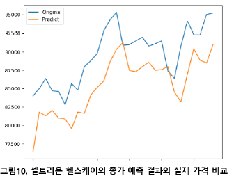

# StockPrediction
네이버 주식 데이터를 크롤러를 통해 수집하고 LSTM을 이용하여 주식 가격을 예측했습니다.

* 코스피 시장과 코스닥 시장의 변동성을 고려하여 코스피의 삼성전자와 코스닥의 셀트리온 헬스케어를 예측 종목으로 선택하였습니다.
* 주가 데이터를 위한 크롤링은 [Naver 금융](https://finance.naver.com/) 페이지를 사용하였습니다.
* 주가 예측을 위해서는 긴 시간 축을 가져도 좋은 성능을 기록할 수 있는 LSTM 모델을 사용하였습니다.
* 주가 예측에는 시가(Open Price), 종가(Close Price), 거래량(Volume)을 예측하도록 하였고 평가 지표로는 RMSE(Root Mean Square Error)를 사용하였습니다.

## Dependencies
* pandas
* lxml
* tqdm
* torch
* scikit-learn
* matplotlib
* numpy

## Usage

### 1. 데이터 수집
[Naver 금융](https://finance.naver.com/) 페이지에서 각 종목에 대한 하루 단위의 시가 종가 거래량을 크롤러를 통해 수집하였습니다. 각 종목별 수집한 데이터는 다음과 같은 수집 기간과 일 수를 가집니다.

| 종목                | 수집 기간                  | 수집 일 수    |
| ------------------ | ------------------------ | ------------ |
| 삼성전자             | 2001.10.29 ~ 2018.04.27 | 4084(일)      |
| 셀트리온 헬스케어     | 2017.07.28 ~ 2020.06.08  | 700 (일)     |
    
다음과 같은 명령어를 통해 크롤러를 동작할 수 있습니다.(실행하기 전에 `crawler` 디렉토리로 이동하여 주세요.)
* `code`는 종목 코드를 의미합니다. ex) 셀트리온 헬스케어 : `091990`
* 실행 결과는 `StockDataSet` 디렉토리에 `.csv` 파일의 형태로 저장됩니다.
```bash
python crawler_naver_stock.py --code 091990
```

### 2. 데이터 분할
* 가장 최근 2년의 데이터를 평가 데이터셋으로 설정하고 나머지 데이터를 학습 데이터셋으로 설정하였습니다.
* 학습 데이터셋과 평가 데이터셋으로 데이터를 분할하기 위해서는 `./data` 디렉토리에 크롤링을 통해 수집한 데이터가 `.csv` 파일 형태로 준비되어 있어야 합니다.
* 다음과 같은 명령어를 통해 학습 데이터셋과 평가 데이터셋으로 분할 할 수 있습니다.
* 실행 결과, `./data/train.csv`와 `./data/test.csv` 파일이 생성됩니다.
```bash
python build_train_eval.py
```

### 3. 모델 훈련 방법
다음과 같은 명령어를 통해 수행할 수 있습니다.

```bash
python run_stock_predict.py --model_type lstm \
                            --do_train \
                            --do_eval \
                            --data_dir ./data \
                            --per_gpu_train_batch_size=8 \
                            --per_gpu_eval_batch_size=8 \
                            --learning_rate 1e-3 \
                            --num_train_epochs 8.0 \
                            --output_dir ./output \
                            --output_mode regression \
                            --target volume \
                            --domain samsung \
                            --window_size 10
```

훈련을 완료하고 나면 `./output`에 `model.out` 파일이 생성되고 이 파일은 학습된 모델의 파라미터들을 저장하고 있습니다.

## Results

### 1. 실험 결과

삼성 전자의 주식 시세를 나타내는 각 지표들을 입력 시퀀스 별로 학습시킨 RMSE 성능은 다음과 같습니다.

|                    | 시가  | 종가   | 거래량 |
| ------------------ | ---- | ----- | ----- |
| window_size = 10   | 0.15 | **0.04**  | 0.09  |
| window_size = 30   | 0.06 | 0.08  | **0.08**  |
| window_size = 50   | **0.03** | **0.04**  | **0.08**  |

셀트리온 헬스케어의 주식 시세를 나타내는 각 지표들을 입력 시퀀스 별로 학습시킨 RMSE 성능은 다음과 같습니다.

|                    | 시가  | 종가   | 거래량 |
| ------------------ | ---- | ----- | ----- |
| window_size = 10   | 0.14 | 0.13  | 0.19  |
| window_size = 30   | 0.16 | 0.13  | 0.22  |
| window_size = 50   | **0.13** | **0.12**  | **0.13**  |

### 2. 예측 결과 시각화

삼성 전자의 종가를 50일의 window 크기를 갖는 LSTM으로 예측한 결과와 실제 종가를 비교한 차트는 다음과 같습니다.


셀트리온 헬스케어의 종가를 50일의 window 크기를 갖는 LSTM으로 예측한 결과와 실제 종가를 비교한 차트는 다음과 같습니다.


